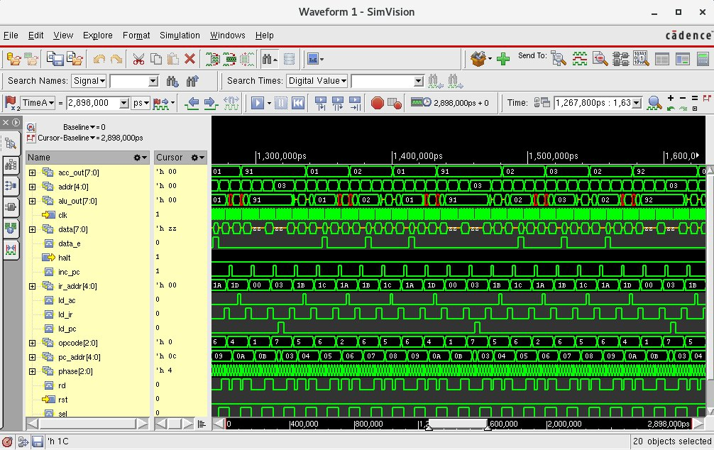

<h1 id="inicio" align="center">
   
  
   

Verilog Language and Application v27.0

</h1>

[< Back to other cadence courses](https://github.com/taffarel55/CADEMICS)

---

<h2 id="contribuir">📫 Contributing to this repository</h2>

Contributions are what make the open source community an amazing place to learn, inspire and create. Any contributions you make are very welcome!

If you want to help by suggesting text and spelling corrections or some code tweaks, you can open a pull request and I'll love it!!! :heart_eyes:

> If you have a quick contribution that doesn't involve code, content or you want to report a problem without having to propose changes [click here](https://github.com/<USER_NAME>/<PROJECT_NAME>/issues/new) to create an issue.

### If not, follow these steps

1. Fork this repository.
2. Create a branch: `git checkout -b newResource`.
3. Add your edits for the next commit: `git add .`
4. Make your changes and confirm them: `git commit -m 'Message from your contribution'`.
5. Specify a new upstream remote repository that will be synchronized with the fork: `git remote add upstream git@github.com:<USER_NAME>/<REPOSITOR_NAME>.git`
6. Send to the original branch: `git push --set-upstream origin newResource`
7. Create the pull request using the link that appears in the terminal.

## 🤝 Contributors

We would like to thank the following people who contributed to this project:

<table>
  <tr>
    <td align="center">
      <a href="https://github.com/taffarel55">
         
        
          <b>Maurício Taffarel</b>
        
      </a>
    </td>
    <!--
    <td align="center">
      <a href="#">
         
        
          <b>Mark Zuckerberg</b>
        
      </a>
    </td>
    <td align="center">
      <a href="#">
         
        
          <b>Steve Jobs</b>
        
      </a>
    </td>
    -->
  </tr>
</table>

## 📝 License

This project is under license. See the [LICENSE](LICENSE) file for more details.

[⬆ Back to top](#inicio) 