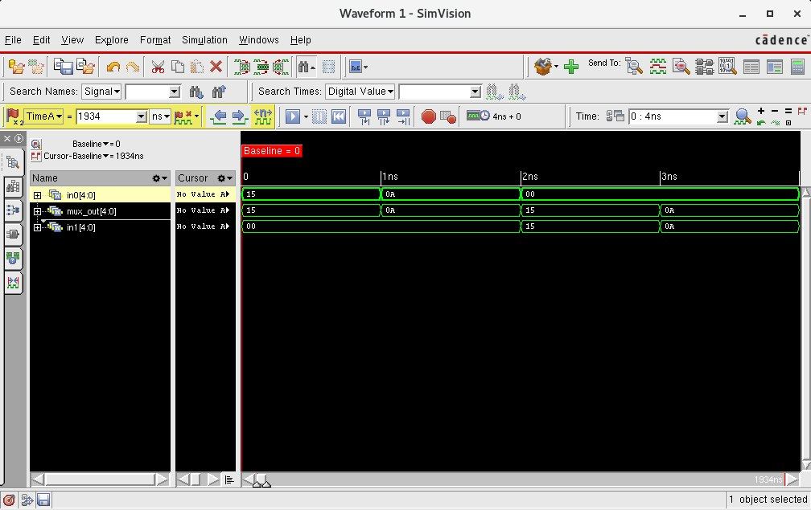

## lab3-mux



```bash
[mauricio@lcci08 lab3-mux]$ xrun -f filelist.txt -access rwc
TOOL: xrun 23.03-s001: Started on Aug 29, 2023 at 21:16:44 -03
xrun: 23.03-s001: (c) Copyright 1995-2023 Cadence Design Systems, Inc.
Loading snapshot worklib.multiplexor_test:v .................... Done
xcelium> source /eda/cadence/installs_2022/XCELIUM2303/tools/xcelium/files/xmsimrc
xcelium> run
At time 1 sel=0 in0=10101 in1=00000, mux_out=10101
At time 2 sel=0 in0=01010 in1=00000, mux_out=01010
At time 3 sel=1 in0=00000 in1=10101, mux_out=10101
At time 4 sel=1 in0=00000 in1=01010, mux_out=01010
TEST PASSED
Simulation complete via $finish(1) at time 4 NS + 0
./multiplexor_test.v:47     $finish;
xcelium> exit
TOOL: xrun 23.03-s001: Exiting on Aug 29, 2023 at 21:16:44 -03  (total: 00:00:00)
```
