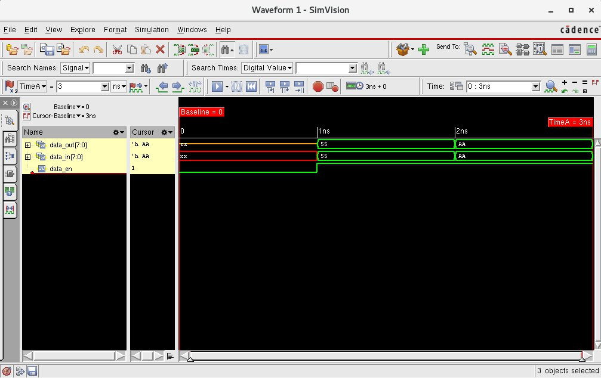

## lab4-drvr



```bash
[mauricio@lcci08 lab4-drvr]$ xrun -f filelist.txt -access rwc
TOOL: xrun 23.03-s001: Started on Aug 29, 2023 at 21:17:18 -03
xrun: 23.03-s001: (c) Copyright 1995-2023 Cadence Design Systems, Inc.
Loading snapshot worklib.driver_test:v .................... Done
xcelium> source /eda/cadence/installs_2022/XCELIUM2303/tools/xcelium/files/xmsimrc
xcelium> run
At time 1 data_en=0 data_in=xxxxxxxx data_out=zzzzzzzz
At time 2 data_en=1 data_in=01010101 data_out=01010101
At time 3 data_en=1 data_in=10101010 data_out=10101010
TEST PASSED
Simulation complete via $finish(1) at time 3 NS + 0
./driver_test.v:44     $finish;
xcelium> exit
TOOL: xrun 23.03-s001: Exiting on Aug 29, 2023 at 21:17:18 -03  (total: 00:00:00)
```