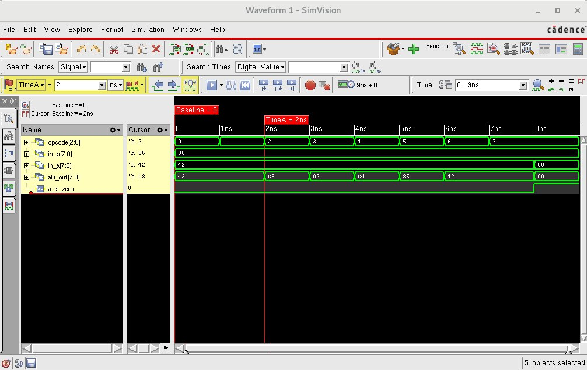

## lab5-alu



```bash
[mauricio@lcci08 lab5-alu]$ xrun -f filelist.txt -access rwc
TOOL: xrun 23.03-s001: Started on Aug 29, 2023 at 21:27:43 -03
xrun: 23.03-s001: (c) Copyright 1995-2023 Cadence Design Systems, Inc.
Loading snapshot worklib.alu_test:v .................... Done
xcelium> source /eda/cadence/installs_2022/XCELIUM2303/tools/xcelium/files/xmsimrc
xcelium> run
At time 1 opcode=000 in_a=01000010 in_b=10000110 a_is_zero=0 alu_out=01000010
At time 2 opcode=001 in_a=01000010 in_b=10000110 a_is_zero=0 alu_out=01000010
At time 3 opcode=010 in_a=01000010 in_b=10000110 a_is_zero=0 alu_out=11001000
At time 4 opcode=011 in_a=01000010 in_b=10000110 a_is_zero=0 alu_out=00000010
At time 5 opcode=100 in_a=01000010 in_b=10000110 a_is_zero=0 alu_out=11000100
At time 6 opcode=101 in_a=01000010 in_b=10000110 a_is_zero=0 alu_out=10000110
At time 7 opcode=110 in_a=01000010 in_b=10000110 a_is_zero=0 alu_out=01000010
At time 8 opcode=111 in_a=01000010 in_b=10000110 a_is_zero=0 alu_out=01000010
At time 9 opcode=111 in_a=00000000 in_b=10000110 a_is_zero=1 alu_out=00000000
TEST PASSED
Simulation complete via $finish(1) at time 9 NS + 0
./alu_test.v:61     $finish;
xcelium> exit
TOOL: xrun 23.03-s001: Exiting on Aug 29, 2023 at 21:27:43 -03  (total: 00:00:00)
```
