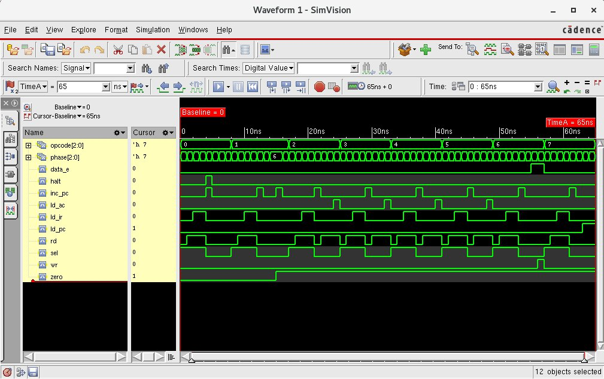

## lab6-ctrl



```bash
[mauricio@lcci08 lab6-ctrl]$ xrun -f filelist.txt -access rwc
TOOL: xrun 23.03-s001: Started on Aug 29, 2023 at 21:32:46 -03
xrun: 23.03-s001: (c) Copyright 1995-2023 Cadence Design Systems, Inc.
Loading snapshot worklib.controller_test:v .................... Done
xcelium> source /eda/cadence/installs_2022/XCELIUM2303/tools/xcelium/files/xmsimrc
xcelium> run
Testing opcode HLT phase 0 1 2 3 4 5 6 7
Testing opcode SKZ phase 0 1 2 3 4 5 6 7
Testing opcode ADD phase 0 1 2 3 4 5 6 7
Testing opcode AND phase 0 1 2 3 4 5 6 7
Testing opcode XOR phase 0 1 2 3 4 5 6 7
Testing opcode LDA phase 0 1 2 3 4 5 6 7
Testing opcode STO phase 0 1 2 3 4 5 6 7
Testing opcode JMP phase 0 1 2 3 4 5 6 7
TEST PASSED
Simulation complete via $finish(1) at time 65 NS + 0
./controller_test.v:146     $finish;
xcelium> exit
TOOL: xrun 23.03-s001: Exiting on Aug 29, 2023 at 21:32:46 -03  (total: 00:00:00)
```
