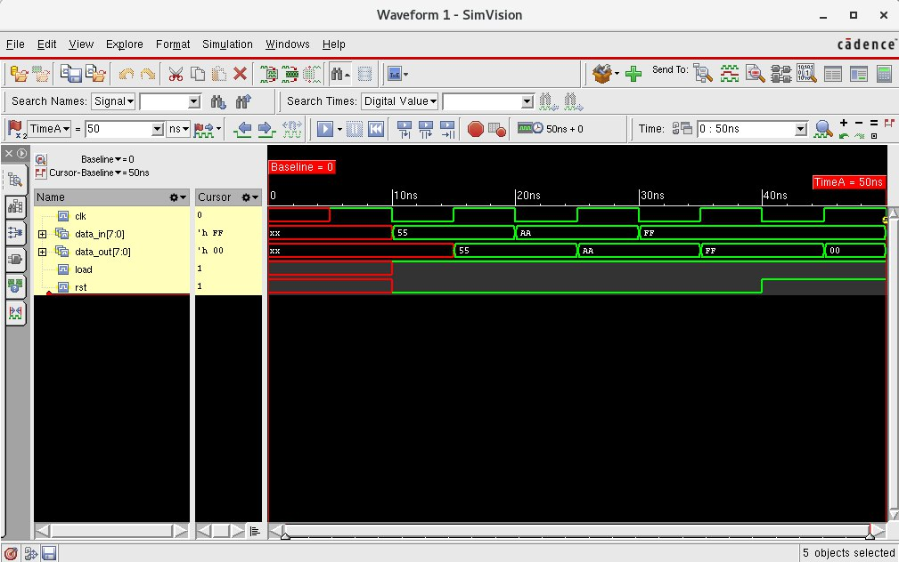

## lab7-reg



```bash
[mauricio@lcci08 lab7-reg]$ xrun -f filelist.txt -access rwc
TOOL: xrun 23.03-s001: Started on Aug 29, 2023 at 21:34:35 -03
xrun: 23.03-s001: (c) Copyright 1995-2023 Cadence Design Systems, Inc.
Loading snapshot worklib.register_test:v .................... Done
xcelium> source /eda/cadence/installs_2022/XCELIUM2303/tools/xcelium/files/xmsimrc
xcelium> run
At time 20 rst=0 load=1 data_in=01010101 data_out=01010101
At time 30 rst=0 load=1 data_in=10101010 data_out=10101010
At time 40 rst=0 load=1 data_in=11111111 data_out=11111111
At time 50 rst=1 load=1 data_in=11111111 data_out=00000000
TEST PASSED
Simulation complete via $finish(1) at time 50 NS + 0
./register_test.v:52     $finish;
xcelium> exit
TOOL: xrun 23.03-s001: Exiting on Aug 29, 2023 at 21:34:35 -03  (total: 00:00:00)
```
