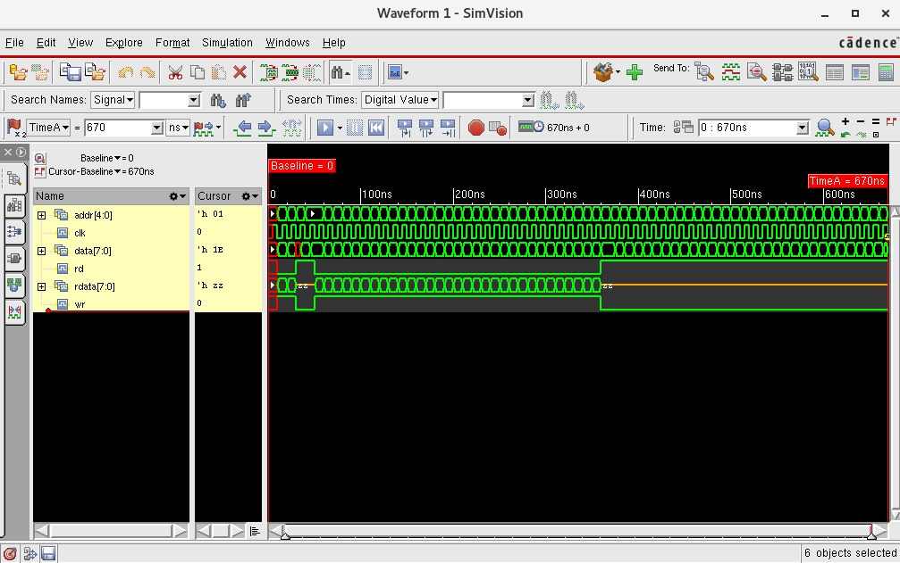

## lab8-mem



```bash
[mauricio@lcci08 lab8-mem]$ xrun -f filelist.txt -access rwc
TOOL: xrun 23.03-s001: Started on Aug 29, 2023 at 21:35:53 -03
xrun: 23.03-s001: (c) Copyright 1995-2023 Cadence Design Systems, Inc.
Loading snapshot worklib.memory_test:v .................... Done
xcelium> source /eda/cadence/installs_2022/XCELIUM2303/tools/xcelium/files/xmsimrc
xcelium> run
Writing addr=00000 data=11111111
Writing addr=11111 data=00000000
Reading addr=00000 data=11111111
At time 40 addr=00000 data=11111111
Reading addr=11111 data=00000000
At time 50 addr=11111 data=00000000
Writing ascending data to   descending addresses
Reading ascending data from descending addresses
At time 370 addr=11111 data=00000000
At time 380 addr=11110 data=00000001
At time 390 addr=11101 data=00000010
At time 400 addr=11100 data=00000011
At time 410 addr=11011 data=00000100
At time 420 addr=11010 data=00000101
At time 430 addr=11001 data=00000110
At time 440 addr=11000 data=00000111
At time 450 addr=10111 data=00001000
At time 460 addr=10110 data=00001001
At time 470 addr=10101 data=00001010
At time 480 addr=10100 data=00001011
At time 490 addr=10011 data=00001100
At time 500 addr=10010 data=00001101
At time 510 addr=10001 data=00001110
At time 520 addr=10000 data=00001111
At time 530 addr=01111 data=00010000
At time 540 addr=01110 data=00010001
At time 550 addr=01101 data=00010010
At time 560 addr=01100 data=00010011
At time 570 addr=01011 data=00010100
At time 580 addr=01010 data=00010101
At time 590 addr=01001 data=00010110
At time 600 addr=01000 data=00010111
At time 610 addr=00111 data=00011000
At time 620 addr=00110 data=00011001
At time 630 addr=00101 data=00011010
At time 640 addr=00100 data=00011011
At time 650 addr=00011 data=00011100
At time 660 addr=00010 data=00011101
At time 670 addr=00001 data=00011110
TEST PASSED
Simulation complete via $finish(1) at time 670 NS + 0
./memory_test.v:80     $finish;
xcelium> exit
TOOL: xrun 23.03-s001: Exiting on Aug 29, 2023 at 21:35:53 -03  (total: 00:00:00)
```
