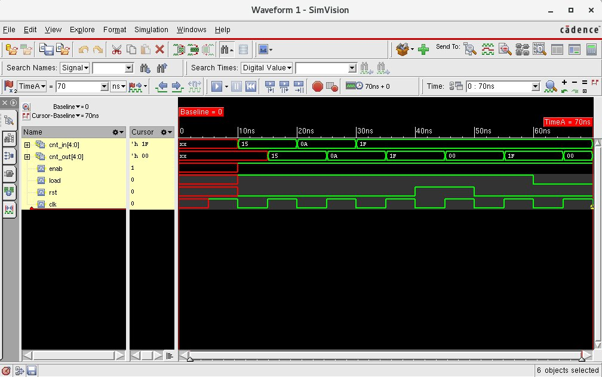

## lab9-cntr



```bash
[mauricio@lcci08 lab9-cntr]$ xrun -f filelist.txt -access rwc
TOOL: xrun 23.03-s001: Started on Aug 29, 2023 at 21:38:40 -03
xrun: 23.03-s001: (c) Copyright 1995-2023 Cadence Design Systems, Inc.
Loading snapshot worklib.counter_test:v .................... Done
xcelium> source /eda/cadence/installs_2022/XCELIUM2303/tools/xcelium/files/xmsimrc
xcelium> run
At time 20 rst=0 load=1 enab=1 cnt_in=10101 cnt_out=10101
At time 30 rst=0 load=1 enab=1 cnt_in=01010 cnt_out=01010
At time 40 rst=0 load=1 enab=1 cnt_in=11111 cnt_out=11111
At time 50 rst=1 load=1 enab=1 cnt_in=11111 cnt_out=00000
At time 60 rst=0 load=1 enab=1 cnt_in=11111 cnt_out=11111
At time 70 rst=0 load=0 enab=1 cnt_in=11111 cnt_out=00000
TEST PASSED
Simulation complete via $finish(1) at time 70 NS + 0
./counter_test.v:56     $finish;
xcelium> exit
TOOL: xrun 23.03-s001: Exiting on Aug 29, 2023 at 21:38:40 -03  (total: 00:00:00)
```
