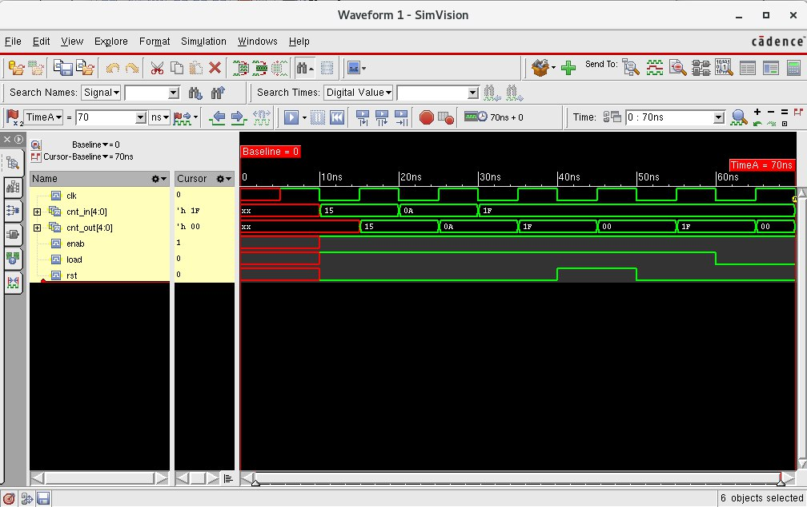
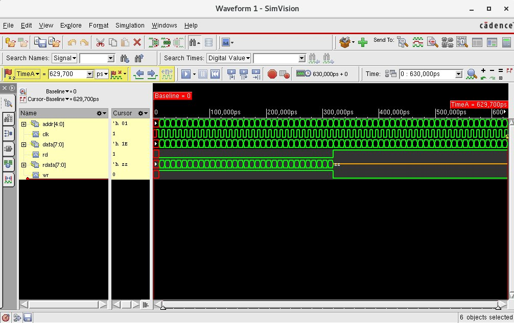

## lab10-func



```bash
[mauricio@lcci08 lab10-func]$ xrun -f filelist.txt -access rwc
TOOL: xrun 23.03-s001: Started on Aug 29, 2023 at 21:40:38 -03
xrun: 23.03-s001: (c) Copyright 1995-2023 Cadence Design Systems, Inc.
Loading snapshot worklib.counter_test:v .................... Done
xcelium> source /eda/cadence/installs_2022/XCELIUM2303/tools/xcelium/files/xmsimrc
xcelium> run
At time 20 rst=0 load=1 enab=1 cnt_in=10101 cnt_out=10101
At time 30 rst=0 load=1 enab=1 cnt_in=01010 cnt_out=01010
At time 40 rst=0 load=1 enab=1 cnt_in=11111 cnt_out=11111
At time 50 rst=1 load=1 enab=1 cnt_in=11111 cnt_out=00000
At time 60 rst=0 load=1 enab=1 cnt_in=11111 cnt_out=11111
At time 70 rst=0 load=0 enab=1 cnt_in=11111 cnt_out=00000
TEST PASSED
Simulation complete via $finish(1) at time 70 NS + 0
./counter_test.v:56     $finish;
xcelium> exit
TOOL: xrun 23.03-s001: Exiting on Aug 29, 2023 at 21:40:38 -03  (total: 00:00:00)
```

## lab10-task



```bash
[mauricio@lcci08 lab10-task]$ xrun -f filelist.txt -access rwc
TOOL: xrun 23.03-s001: Started on Aug 29, 2023 at 21:42:33 -03
xrun: 23.03-s001: (c) Copyright 1995-2023 Cadence Design Systems, Inc.
Loading snapshot worklib.memory_test:v .................... Done
xcelium> source /eda/cadence/installs_2022/XCELIUM2303/tools/xcelium/files/xmsimrc
xcelium> run
330ns addr=11111, exp_data= 00000000, data=00000000
340ns addr=11110, exp_data= 00000001, data=00000001
350ns addr=11101, exp_data= 00000010, data=00000010
360ns addr=11100, exp_data= 00000011, data=00000011
370ns addr=11011, exp_data= 00000100, data=00000100
380ns addr=11010, exp_data= 00000101, data=00000101
390ns addr=11001, exp_data= 00000110, data=00000110
400ns addr=11000, exp_data= 00000111, data=00000111
410ns addr=10111, exp_data= 00001000, data=00001000
420ns addr=10110, exp_data= 00001001, data=00001001
430ns addr=10101, exp_data= 00001010, data=00001010
440ns addr=10100, exp_data= 00001011, data=00001011
450ns addr=10011, exp_data= 00001100, data=00001100
460ns addr=10010, exp_data= 00001101, data=00001101
470ns addr=10001, exp_data= 00001110, data=00001110
480ns addr=10000, exp_data= 00001111, data=00001111
490ns addr=01111, exp_data= 00010000, data=00010000
500ns addr=01110, exp_data= 00010001, data=00010001
510ns addr=01101, exp_data= 00010010, data=00010010
520ns addr=01100, exp_data= 00010011, data=00010011
530ns addr=01011, exp_data= 00010100, data=00010100
540ns addr=01010, exp_data= 00010101, data=00010101
550ns addr=01001, exp_data= 00010110, data=00010110
560ns addr=01000, exp_data= 00010111, data=00010111
570ns addr=00111, exp_data= 00011000, data=00011000
580ns addr=00110, exp_data= 00011001, data=00011001
590ns addr=00101, exp_data= 00011010, data=00011010
600ns addr=00100, exp_data= 00011011, data=00011011
610ns addr=00011, exp_data= 00011100, data=00011100
620ns addr=00010, exp_data= 00011101, data=00011101
630ns addr=00001, exp_data= 00011110, data=00011110
TEST PASSED
Simulation complete via $finish(1) at time 630 NS + 0
./memory_test.v:91     $finish;
xcelium> exit
TOOL: xrun 23.03-s001: Exiting on Aug 29, 2023 at 21:42:33 -03  (total: 00:00:00)
```
