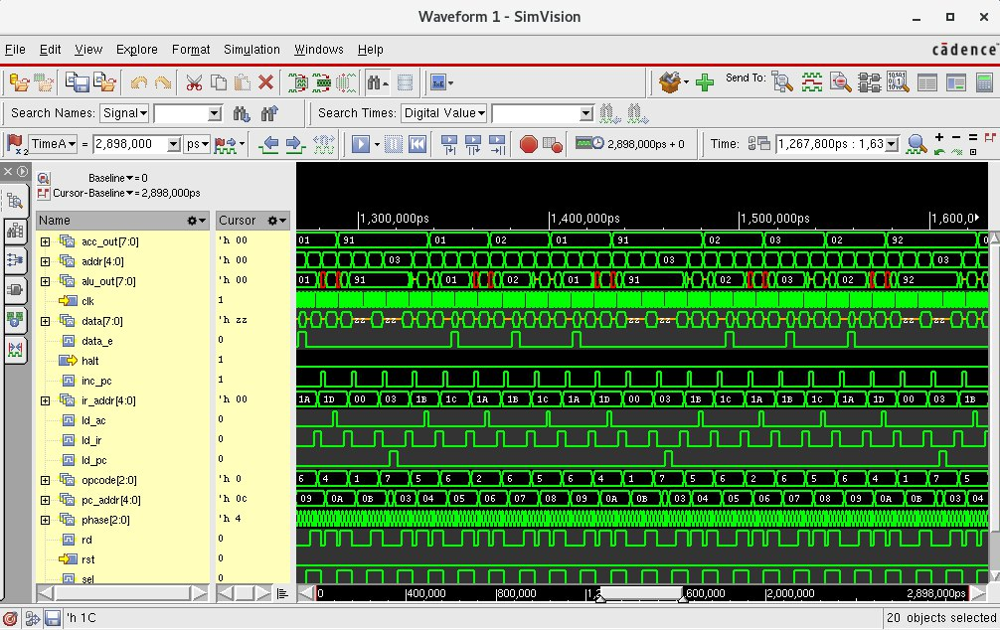

## lab11-risc



```bash
[mauricio@lcci08 lab11-risc]$ xrun -f files.txt -access rwc
TOOL: xrun 23.03-s001: Started on Aug 29, 2023 at 21:47:06 -03
xrun: 23.03-s001: (c) Copyright 1995-2023 Cadence Design Systems, Inc.
Loading snapshot worklib.risc_test:v .................... Done
xcelium> source /eda/cadence/installs_2022/XCELIUM2303/tools/xcelium/files/xmsimrc
xcelium> run
Testing reset
Testing HLT instruction
Testing JMP instruction
Testing SKZ instruction
Testing LDA instruction
Testing STO instruction
Testing AND instruction
Testing XOR instruction
Testing ADD instruction
Doing test CPUtest1.txt
Doing test CPUtest2.txt
Doing test CPUtest3.txt
TEST PASSED
Simulation complete via $finish(1) at time 2898 NS + 0
./risc_test.v:167       $finish;
xcelium> exit
TOOL: xrun 23.03-s001: Exiting on Aug 29, 2023 at 21:47:06 -03  (total: 00:00:00)
```
