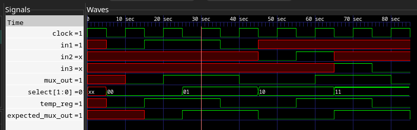

## lab12-muxsynth



2. Verify the RTL model using the the commands with Xcelium™.

```bash
[mauricio@lcci08 lab12-muxsynth]$ xrun mux.v mux_test.v
TOOL: xrun 23.03-s001: Started on Sep 11, 2023 at 14:45:32 -03
xrun: 23.03-s001: (c) Copyright 1995-2023 Cadence Design Systems, Inc.
file: mux.v
 module worklib.mux:v
  errors: 0, warnings: 0
file: mux_test.v
 module worklib.mux_test:v
  errors: 0, warnings: 0
  Caching library 'worklib' ....... Done
 Elaborating the design hierarchy:
 Top level design units:
  mux_test
 Building instance overlay tables: .................... Done
 Generating native compiled code:
  worklib.mux:v <0x4a849725>
   streams:   3, words:   524
  worklib.mux_test:v <0x3fe40a5f>
   streams:   8, words: 13967
 Building instance specific data structures.
 Loading native compiled code:     .................... Done
 Design hierarchy summary:
               Instances  Unique
  Modules:             2       2
  Registers:           8       8
  Scalar wires:        5       -
  Vectored wires:      1       -
  Always blocks:       2       2
  Initial blocks:      2       2
  Pseudo assignments:  5       -
 Writing initial simulation snapshot: worklib.mux_test:v
Loading snapshot worklib.mux_test:v .................... Done
xcelium> source /eda/cadence/installs_2022/XCELIUM2303/tools/xcelium/files/xmsimrc
xcelium> run
time=15 select=00 in1=0 in2=x in3=x mux_out=0
time=25 select=00 in1=1 in2=x in3=x mux_out=1
time=35 select=01 in1=1 in2=x in3=x mux_out=1
time=45 select=01 in1=0 in2=x in3=x mux_out=0
time=55 select=10 in1=x in2=0 in3=x mux_out=0
time=65 select=10 in1=x in2=1 in3=x mux_out=1
time=75 select=11 in1=x in2=x in3=1 mux_out=1
time=85 select=11 in1=x in2=x in3=0 mux_out=0
TEST PASSED
Simulation complete via $finish(1) at time 85 NS + 0
./mux_test.v:36    $finish;
xcelium> exit
TOOL: xrun 23.03-s001: Exiting on Sep 11, 2023 at 14:45:36 -03  (total: 00:00:04)
```

3. Synthesize the RTL model by using the Genus™ Synthesis Solution tool.

[Output file](./3.txt)

4. Verify the gate-level model using the following commands with Xcelium™.

```bash
[mauricio@lcci08 lab12-muxsynth]$ xrun mux.vg mux_test.v -v ../../tutorial.v -vlogext vg
TOOL: xrun 23.03-s001: Started on Sep 11, 2023 at 15:24:12 -03
xrun: 23.03-s001: (c) Copyright 1995-2023 Cadence Design Systems, Inc.
  Caching library 'tutorial' ....... Done
  Caching library 'worklib' ....... Done
 Elaborating the design hierarchy:
 Top level design units:
  mux_test
 Building instance overlay tables: .................... Done
 Building instance specific data structures.
 Loading native compiled code:     .................... Done
 Design hierarchy summary:
                Instances  Unique
  Modules:             11       5
  UDPs:                 1       1
  Registers:            6       7
  Scalar wires:        13       -
  Expanded wires:       2       1
  Initial blocks:       2       2
  Cont. assignments:    0       2
  Pseudo assignments:   5       -
 Writing initial simulation snapshot: worklib.mux_test:v
Loading snapshot worklib.mux_test:v .................... Done
xcelium> source /eda/cadence/installs_2022/XCELIUM2303/tools/xcelium/files/xmsimrc
xcelium> run
time=15 select=00 in1=0 in2=x in3=x mux_out=0
time=25 select=00 in1=1 in2=x in3=x mux_out=1
time=35 select=01 in1=1 in2=x in3=x mux_out=1
time=45 select=01 in1=0 in2=x in3=x mux_out=0
time=55 select=10 in1=x in2=0 in3=x mux_out=0
time=65 select=10 in1=x in2=1 in3=x mux_out=1
time=75 select=11 in1=x in2=x in3=1 mux_out=1
time=85 select=11 in1=x in2=x in3=0 mux_out=0
TEST PASSED
Simulation complete via $finish(1) at time 85 NS + 0
./mux_test.v:36    $finish;
xcelium> exit
TOOL: xrun 23.03-s001: Exiting on Sep 11, 2023 at 15:24:12 -03  (total: 00:00:00)
```

8. Again, verify the RTL model but this time use the following commands with
   Xcelium.

```
[mauricio@lcci08 lab12-muxsynth]$ xrun mux.v mux_test.v -define USE_CASE
TOOL: xrun 23.03-s001: Started on Sep 11, 2023 at 15:15:29 -03
xrun: 23.03-s001: (c) Copyright 1995-2023 Cadence Design Systems, Inc.
file: mux.v
 module worklib.mux:v
  errors: 0, warnings: 0
  Caching library 'worklib' ....... Done
 Elaborating the design hierarchy:
 Top level design units:
  mux_test
 Building instance overlay tables: .................... Done
 Generating native compiled code:
  worklib.mux:v <0x7c731b7e>
   streams:   3, words:   540
 Building instance specific data structures.
 Loading native compiled code:     .................... Done
 Design hierarchy summary:
               Instances  Unique
  Modules:             2       2
  Registers:           8       8
  Scalar wires:        5       -
  Vectored wires:      1       -
  Always blocks:       2       2
  Initial blocks:      2       2
  Pseudo assignments:  5       -
 Writing initial simulation snapshot: worklib.mux_test:v
Loading snapshot worklib.mux_test:v .................... Done
xcelium> source /eda/cadence/installs_2022/XCELIUM2303/tools/xcelium/files/xmsimrc
xcelium> run
time=15 select=00 in1=0 in2=x in3=x mux_out=0
time=25 select=00 in1=1 in2=x in3=x mux_out=1
time=35 select=01 in1=1 in2=x in3=x mux_out=1
time=45 select=01 in1=0 in2=x in3=x mux_out=0
time=55 select=10 in1=x in2=0 in3=x mux_out=0
time=65 select=10 in1=x in2=1 in3=x mux_out=1
time=75 select=11 in1=x in2=x in3=1 mux_out=1
time=85 select=11 in1=x in2=x in3=0 mux_out=0
TEST PASSED
Simulation complete via $finish(1) at time 85 NS + 0
./mux_test.v:36    $finish;
xcelium> exit
TOOL: xrun 23.03-s001: Exiting on Sep 11, 2023 at 15:15:29 -03  (total: 00:00:00)
```

9. Synthesize the design again and examine the pre-synthesis and post-synthesis netlists.

[Output file](./9.txt)
