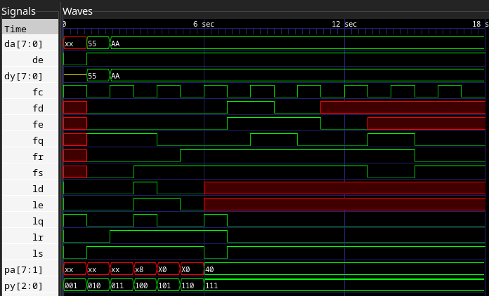

## lab13-lib



3. Verify the RTL model(s) using the following commands with Xcelium™.

```
[mauricio@lcci08 lab13-lib]$ xrun lib.v lib_test.v -define macrolib
TOOL: xrun 23.03-s001: Started on Sep 11, 2023 at 16:24:28 -03
xrun: 23.03-s001: (c) Copyright 1995-2023 Cadence Design Systems, Inc.
file: lib.v
 module worklib.priority7:v
  errors: 0, warnings: 0
 module worklib.latchrs:v
  errors: 0, warnings: 0
 module worklib.dffrs:v
  errors: 0, warnings: 0
 module worklib.drive8:v
  errors: 0, warnings: 0
file: lib_test.v
 module worklib.lib_test:v
  errors: 0, warnings: 0
  Caching library 'worklib' ....... Done
 Elaborating the design hierarchy:
 Top level design units:
  lib_test
 Building instance overlay tables: .................... Done
 Generating native compiled code:
  worklib.drive8:v <0x584fbdb2>
   streams:   1, words:   247
  worklib.dffrs:v <0x130c884b>
   streams:   2, words:   521
  worklib.latchrs:v <0x0865acd2>
   streams:   2, words:   494
  worklib.priority7:v <0x25343d09>
   streams:   1, words:   515
  worklib.lib_test:v <0x17b6cfc9>
   streams:  22, words: 29299
 Building instance specific data structures.
 Loading native compiled code:     .................... Done
 Design hierarchy summary:
                Instances  Unique
  Modules:              5       5
  Registers:           20      20
  Scalar wires:        12       -
  Vectored wires:       4       -
  Always blocks:        4       4
  Initial blocks:       6       6
  Pseudo assignments:  12       -
 Writing initial simulation snapshot: worklib.lib_test:v
Loading snapshot worklib.lib_test:v .................... Done
xcelium> source /eda/cadence/installs_2022/XCELIUM2303/tools/xcelium/files/xmsimrc
xcelium> run
xmsim: *W,DVEXACC: some objects excluded from $dumpvars due to access restrictions, use +access+r on command line for access to all objects.
            File: ./lib_test.v, line = 35, pos = 12
           Scope: lib_test
            Time: 0 FS + 0

TEST PASSED - DRIVER
TEST PASSED - PRIORITY
TEST PASSED - LATCH
TEST PASSED - DFF
xmsim: *W,RNQUIE: Simulation is complete.
xcelium> exit
TOOL: xrun 23.03-s001: Exiting on Sep 11, 2023 at 16:24:30 -03  (total: 00:00:02)
```

5. When all models pass their test, synthesize the RTL models by using the Genus™ Synthesis Solution tool.

`genus -f genus_shell.tcl > 5.txt`

[Output file](5.txt)

6. Verify the gate-level models using the following commands with Xcelium.

`xrun *.vg lib_test.v -v ../../tutorial.v -vlogext vg -define macrolib > 6.txt`

[Output file](6.txt)
